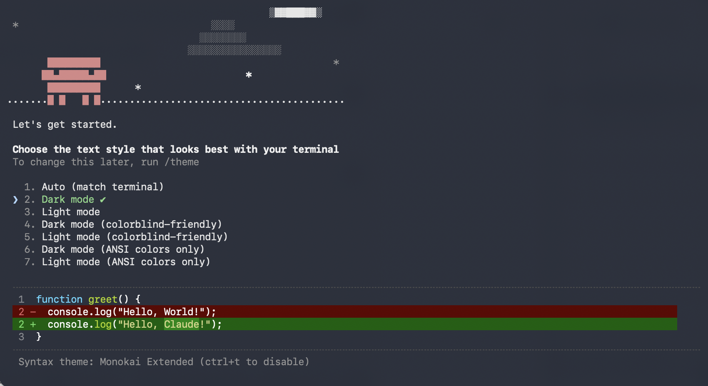
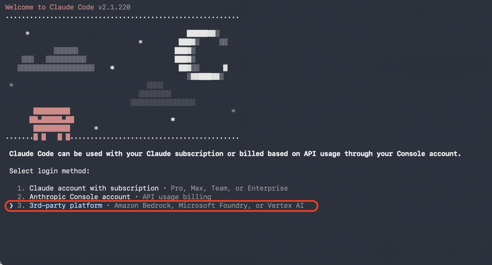
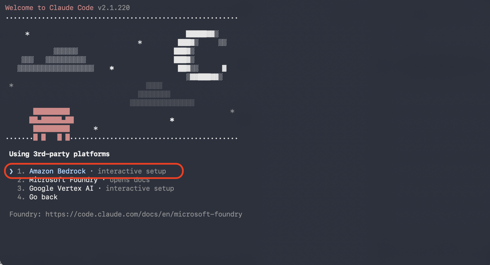
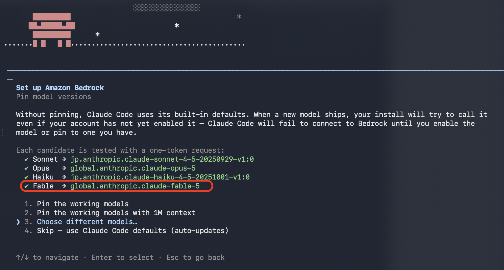

# Bedrockの設定(Jetson側)

## JetsonにログインしClaudeのVersionを確認

```bash
claude --version
```

```bash
2.1.220 (Claude Code)
```

## AWS CLIのVersion


AWS cliをインストール

```bash
cd /tmp

curl "https://awscli.amazonaws.com/awscli-exe-linux-aarch64.zip" \
  -o "awscliv2.zip"

sudo apt-get update
sudo apt-get install -y unzip

unzip awscliv2.zip
sudo ./aws/install
```

AWS cliのVersionを確認

```bash
aws --version
```

```bash
aws-cli/2.36.14 Python/3.14.6 Linux/6.8.12-1021-tegra exe/aarch64.ubuntu.24
```

## AWS SSOの設定

```bssh
aws sso login --profile my-pak-profile --use-device-code
```

SSOのstart URL, リージョンなどを設定します。

```bash
SSO session name (Recommended): lerobot
SSO start URL [None]: https://d-xxxxxxxxxx.awsapps.com/start
SSO region [None]: ap-northeast-1
SSO registration scopes [sso:account:access]:
```

URLが表示されるのと発行されたKeyを入力し設定します。

## BedrockのClaude Fable 5のprovider_data_shareの設定

AWSでCloud Shellを起動して、Fable5のprovider_data_shareの設定を有効化します。

```
aws bedrock put-account-data-retention --mode provider_data_share --region ap-northeast-1
```
## Claude Codeの設定

Jetson上で、claudeを起動します。

画面モードを選択



3rd-party platformを選択



Amazon Bedrockを選択



先ほど設定したssoのProfileのmy-pak-profileを選択し、fable5が出てくれば連動成功です。fable5が有効にならない場合、rovider_data_shareの設定がおこなわれていない可能性があります。



