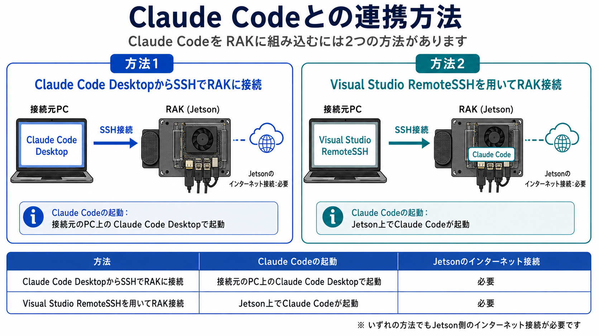

# Claude Codeとの連携方法

## Claude Code連携のメリット

Physical Agent Kit(PAK)とClaude Codeを連携させることで、プラグインの自動作成や、学習等の各種コマンドのサポート、LeRobotで足りない機能の拡張などが可能となります。

## Claude Codeとの連携方法

Claude CodeをPAKに組み込むには2つの方法があります。1つ目はClaude Code DesktopからSSHでPAKに接続し連携する方法です。2つ目はVisual Studio RemoteSSHを用いてPAK接続しClaude Codeをコマンドで起動して連携する方法です。

|方法|Claude Codeの起動|Jetsonのインターネット接続|
|:--|:--|:--|
|Claude Code DesktopからSSHでPAKに接続|接続元のPC上のClaude Code Desktopで起動|必要|
|Visual Studio RemoteSSHを用いてPAK接続|Jetson上でClaude Codeが起動|必要|

