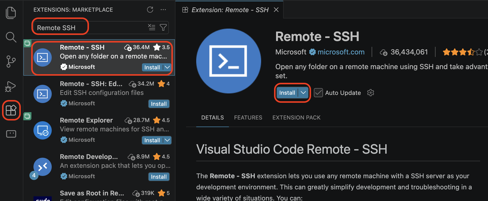
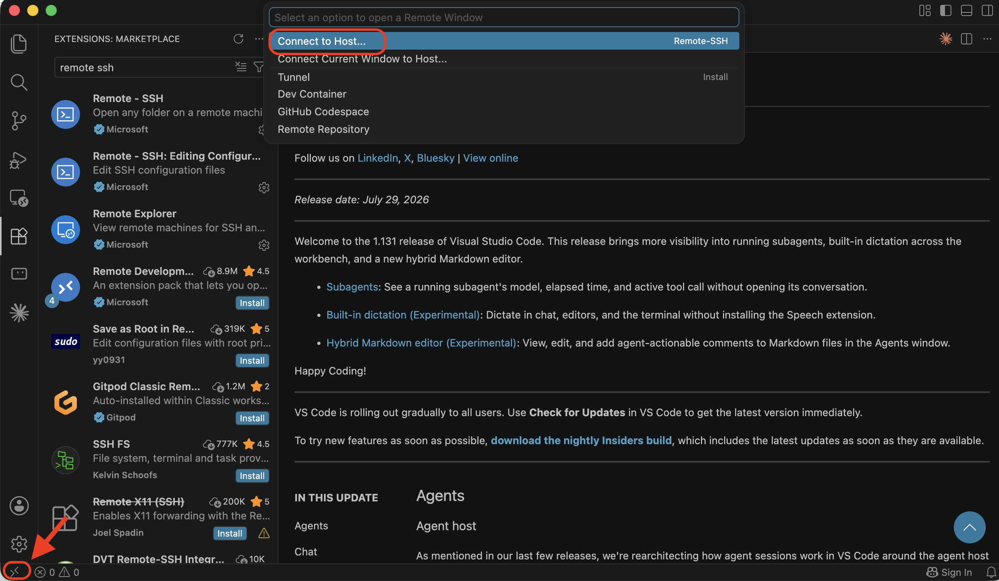
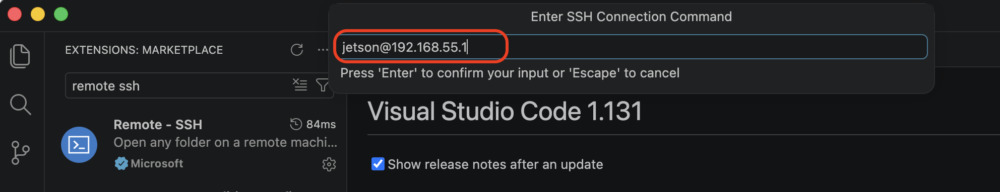
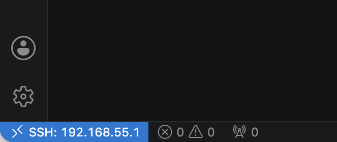
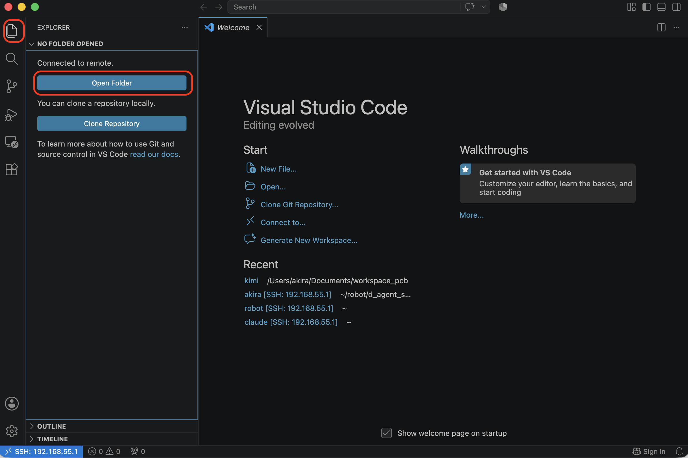
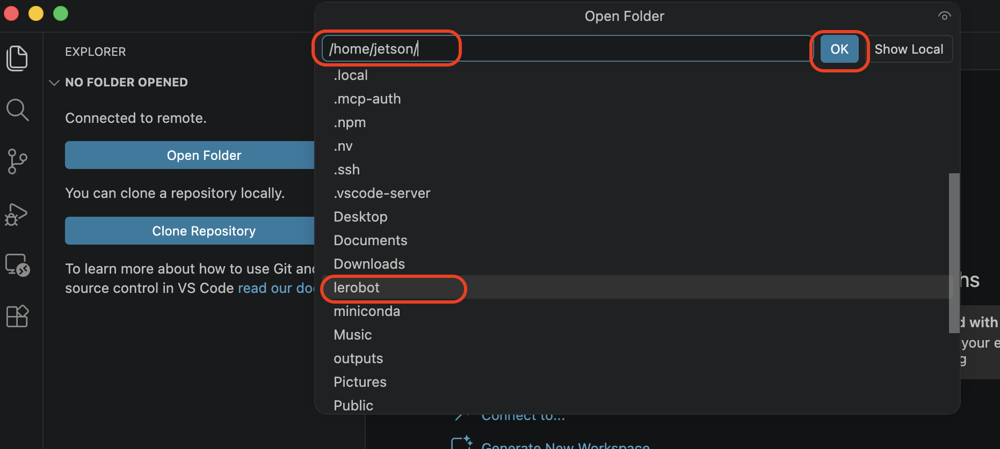
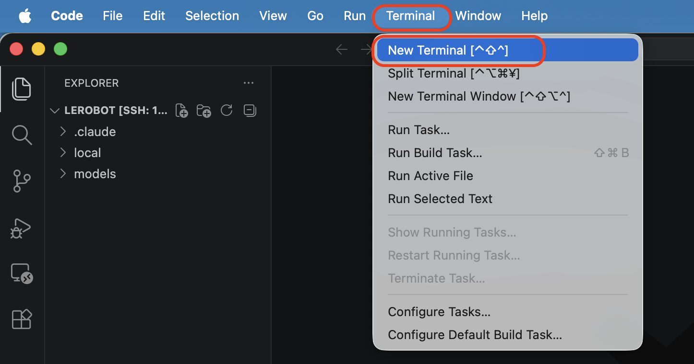
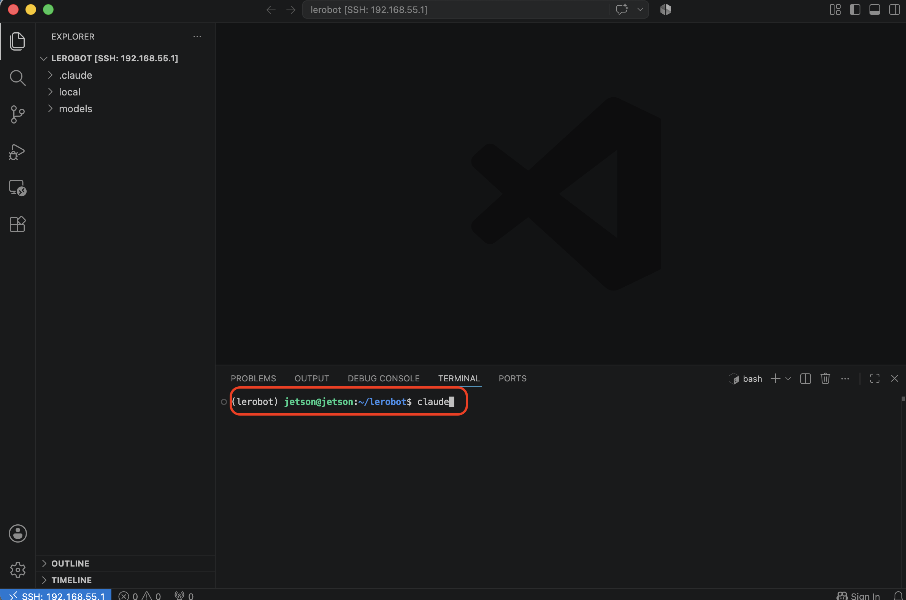
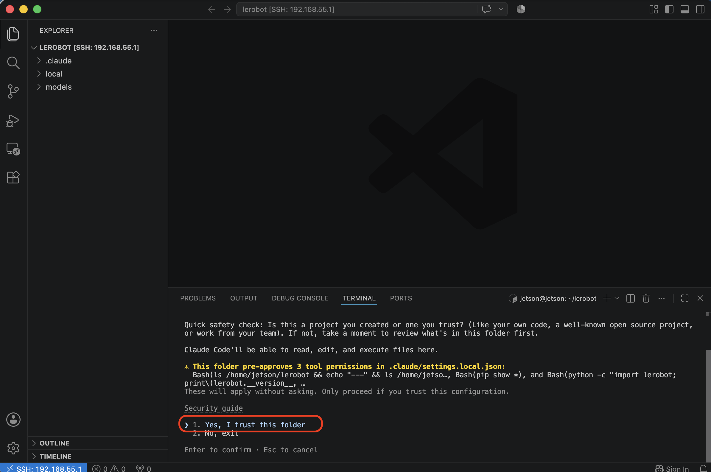
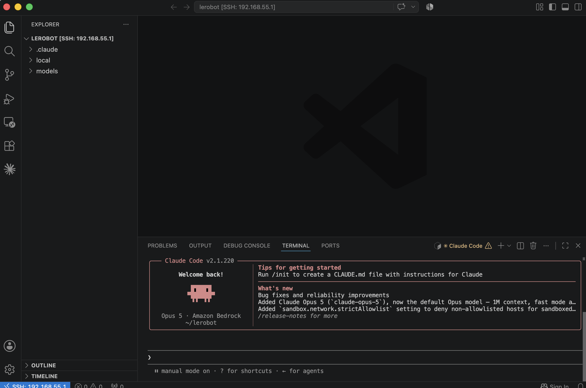

# Visual Studio Code

## 1.VSCode インストール
以下より VSCode をインストールします。

<a href="https://code.visualstudio.com/" target="new">Visual Studio Code</a>

## 2.VSCode 拡張機能インストール

下記Extentionをインストールします。

- Remote SSH 

VSCodeを起動し、Remote SSH Extentionをインストールしてください。

## 3.Remote SSHでJetsonへ接続

## 4.Projectフォルダを開きます

## 5.Terminalを開く

## 6.Claudeを起動

