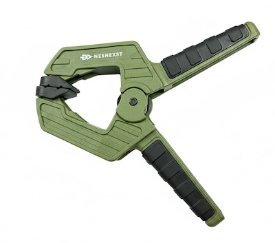
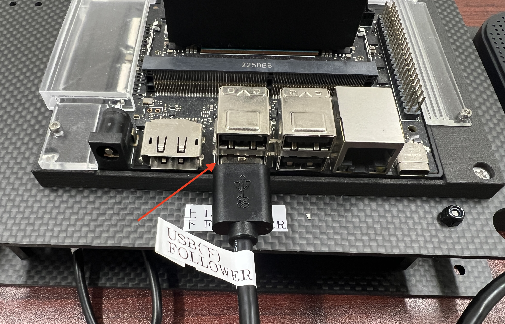
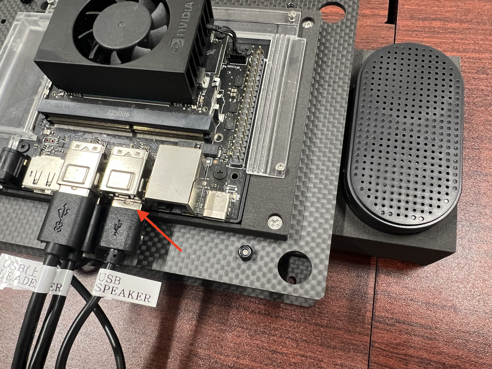
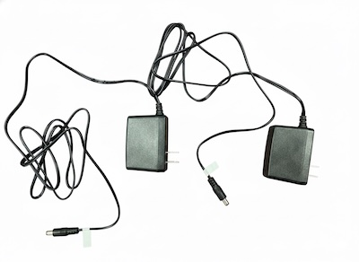
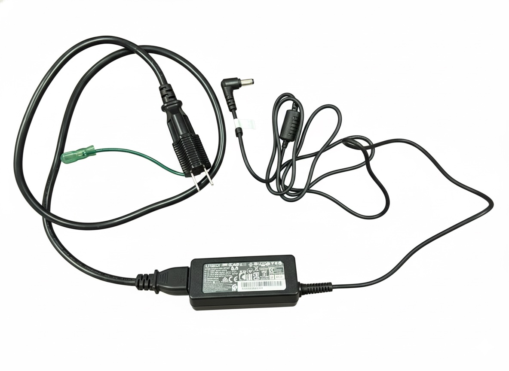

# FaBo LeRobot Kit(SO-101連携) 組み立て　

## SO-101 Follower

SO-101 Followerを固定

同様にSO-101 Leaderを固定

## USBの配線

USB Type-Cケーブルを使って、JetsonとSO-101 Follower, Leaderを接続します

SO-101 FollowerとJetsonをUSB Type-Cケーブルで接続します。

!!!Warning
    FollowerのUSBケーブルは必ず下の位置に差してください

SO-101 LeaderとJetsonをUSB Type-Cケーブルで接続します。

!!!Warning
    LeaderのUSBケーブルは必ず上の位置に差してください

## USB Speakerの配線

## USB Camera

USBカメラを設置してください。

Jetsonに接続します。

## ロボットアーム電源

## Jetson電源

