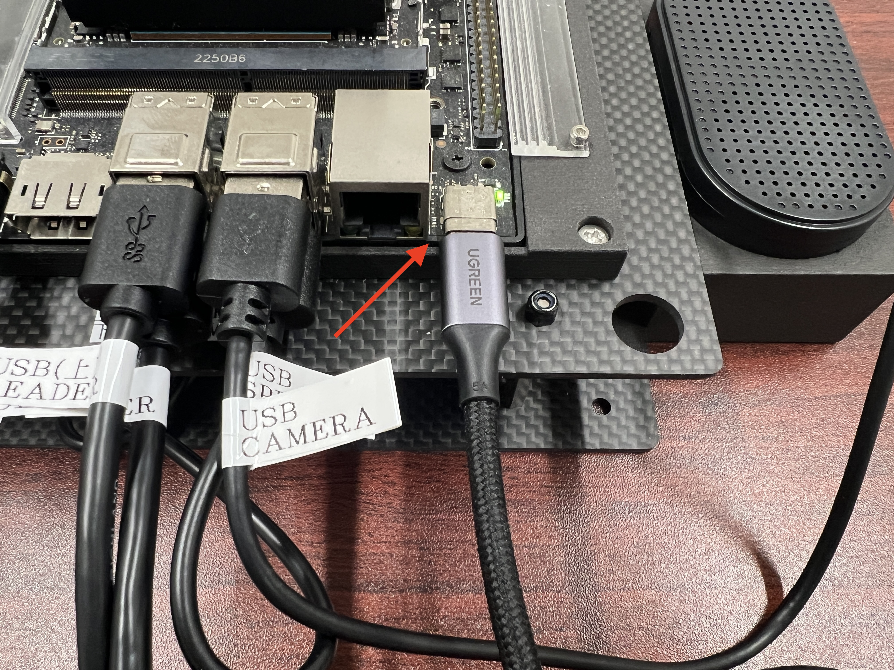
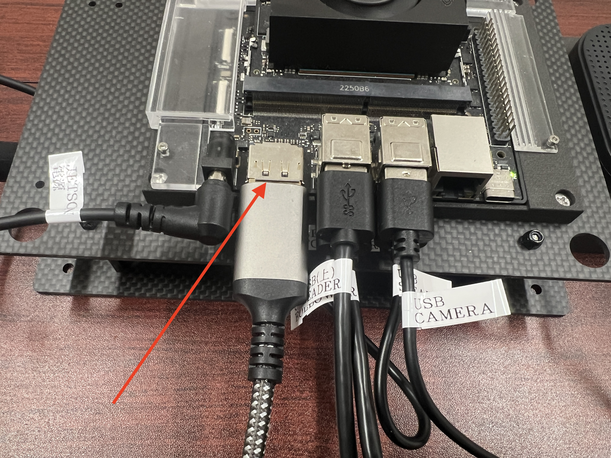

# FaBo LeRobot Kit(SO-101連携) 動作確認

## Jetsonとの接続

MacBookユーザはJetsonとUSB Type Cケーブルで接続し、Jetsonにログインできます





```
ssh jetson@192.168.55.1
```

|項目|値|
|:--|:--|
|id|jetson|
|pass|jetson|


## Displayとの接続


JetsonをDisplayに接続します。



USB Speakerを外し、USBハブを接続します。


JetsonにUBS Speakerを接続し直します。
キーボード、マウスを接続し、Ubuntuを画面で操作します。


## USBのso101の差し込みを固定(実施済み)

`/etc/udev/rules.d/99-usb-serial.rules `

```
SUBSYSTEM=="tty", ENV{ID_PATH}=="platform-3610000.usb-usb-0:2.1:1.0", SYMLINK+="so101_leader"
SUBSYSTEM=="tty", ENV{ID_PATH}=="platform-3610000.usb-usb-0:2.2:1.0", SYMLINK+="so101_follower"
```

```
sudo udevadm control --reload-rules
sudo udevadm trigger
```

## Teleop

動作確認としてTeleopを実行します。Jetsonのターミナル上で、下記コマンドを実行します。


```
cd ~/lerobot
```

```
./teleop.sh
```

Scriptの中身

```
lerobot-teleoperate   \
  --robot.type=so101_follower   \
  --robot.port=/dev/so101_follower  \
  --robot.id=my_follower_arm   \
  --teleop.type=so101_leader   \
  --teleop.port=/dev/so101_leader   \
  --teleop.id=my_leader_arm
```

## データセット収集


```
./record.sh
```

Scriptの中身
```
rm -rf /home/jetson/lerobot/d_test
lerobot-record \
  --robot.type=so101_follower \
  --robot.port=/dev/so101_follower \
  --robot.id=my_follower_arm \
  --teleop.type=so101_leader \
  --teleop.port=/dev/so101_leader \
  --teleop.id=my_leader_arm \
  --dataset.repo_id=local/d_test \
  --dataset.root=/home/jetson/lerobot/d_test \
  --dataset.push_to_hub=false \
  --robot.cameras="{ front: {type: opencv, index_or_path: 0, width: 640, height: 480, fps: 30}}" \
  --display_data=true \
  --dataset.single_task=true \
  --dataset.episode_time_s=10 \
  --dataset.reset_time_s=2 \
  --dataset.num_episodes=30
```

## データセット追加収集(5回)


```
./record_resume_5.sh
```

Scriptの中身
```
lerobot-record \
  --robot.type=so101_follower \
  --robot.port=/dev/so101_follower \
  --robot.id=my_follower_arm \
  --teleop.type=so101_leader \
  --teleop.port=/dev/so101_leader \
  --teleop.id=my_leader_arm \
  --dataset.repo_id=local/d_test \
  --dataset.root=/home/jetson/lerobot/d_test \
  --dataset.push_to_hub=false \
  --robot.cameras="{ front: {type: opencv, index_or_path: 0, width: 
640, height: 480, fps: 30}}" \
  --display_data=true \
  --dataset.single_task=true \
  --dataset.episode_time_s=10 \
  --dataset.reset_time_s=2 \
  --dataset.num_episodes=5 \
  --resume=true
```

##  学習

```
./train.sh
```

Scriptの中身
```
rm -rf outputs/train/act_d_test
PYTHONWARNINGS='ignore::UserWarning:torchvision.io._video_deprecation_warning' \
  lerobot-train \
  --dataset.root=/home/jetson/lerobot/d_test \
  --dataset.repo_id=local/d_test \
  --policy.type=act \
  --policy.device=cuda \
  --policy.push_to_hub=false \
  --output_dir=outputs/train/act_d_test \
  --job_name=act_d_test \
  --wandb.enable=false \
  --steps=8000
```

## 実行

```
./run.sh
```

Scriptの中身
```
rm -rf /home/jetson/lerobot/eval_d_test
lerobot-record \
  --robot.type=so101_follower \
  --robot.port=/dev/so101_follower \
  --robot.id=my_follower_arm \
  --dataset.single_task=true \
  --dataset.repo_id=local/eval_d_test \
  --dataset.root=/home/jetson/lerobot/eval_d_test \
  --dataset.push_to_hub=false \
  --robot.cameras='{"front":{"type":"opencv","index_or_path":0,"width":640,"height":480,"fps":30}}' \
  --policy.path="outputs/train/act_d_test/checkpoints/last/pretrained_model/" \
  --display_data=true
```