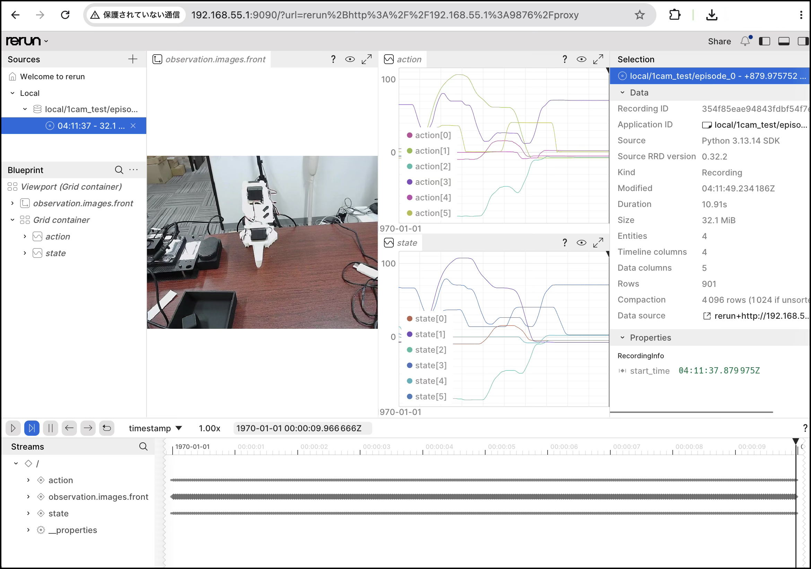

# Cameraの確認

## 1. データセット収集（1回）

既存の同名データセットがあると新規作成に失敗します。削除対象が空文字やルートディレクトリでないことを確認してから削除します。

```bash
rm -rf "{{DATASET_DIR}}"
```

`dataset.episode_time_s`は1エピソードの収集時間、`dataset.reset_time_s`は次のエピソードまでのリセット時間、`dataset.num_episodes`は収集するエピソード数です。

=== "Jetson"

    SSH接続時は、Rerun GUIを起動しないように`--display_data=false`を使用します。

    ```bash
    cd "{{PROJECT_DIR}}"

    lerobot-record \
      --robot.type=so101_follower \
      --robot.port={{ROBOT_PORT}} \
      --robot.id=my_follower_arm \
      --teleop.type=so101_leader \
      --teleop.port={{TELEOP_PORT}} \
      --teleop.id=my_leader_arm \
      --robot.cameras="{front: {type: opencv, index_or_path: '/dev/video0', backend: 200, width: 640, height: 480, fps: 30, fourcc: 'MJPG'}}" \
      --dataset.repo_id={{DATASET_REPO_ID}} \
      --dataset.root={{DATASET_DIR}} \
      --dataset.push_to_hub=false \
      --dataset.single_task="Pick up the red cube" \
      --dataset.fps=30 \
      --dataset.episode_time_s=10 \
      --dataset.reset_time_s=5 \
      --dataset.num_episodes=1 \
      --dataset.streaming_encoding=false \
      --display_data=false \
      --play_sounds=true
    ```

    !!! note
        Jetsonのデスクトップ上のターミナルで実行し、`DISPLAY`または`WAYLAND_DISPLAY`が設定されている場合のみ、必要に応じて`--display_data=true`へ変更できます。SSHでは`false`のまま使用してください。

=== "MacBook"

    Macのカメラ番号が`0`の場合の例です。AVFoundationで`MJPG`が表示されないカメラもあるため、Mac用コマンドでは`fourcc`を固定していません。

    ```bash
    cd "{{PROJECT_DIR}}"

    lerobot-record \
      --robot.type=so101_follower \
      --robot.port={{ROBOT_PORT}} \
      --robot.id=my_follower_arm \
      --teleop.type=so101_leader \
      --teleop.port={{TELEOP_PORT}} \
      --teleop.id=my_leader_arm \
      --robot.cameras="{front: {type: opencv, index_or_path: 0, width: 640, height: 480, fps: 30}}" \
      --dataset.repo_id={{DATASET_REPO_ID}} \
      --dataset.root={{DATASET_DIR}} \
      --dataset.push_to_hub=false \
      --dataset.single_task="Pick up the red cube" \
      --dataset.fps=30 \
      --dataset.episode_time_s=10 \
      --dataset.reset_time_s=5 \
      --dataset.num_episodes=1 \
      --dataset.streaming_encoding=false \
      --display_data=true
    ```

    H.264を明示する場合、LeRobot 0.6.0では旧引数`--dataset.vcodec=h264`ではなく、次を追加します。

    ```bash
    --dataset.rgb_encoder.vcodec=h264
    ```


## 2.Retunを起動

```bash
lerobot-dataset-viz \
  --repo-id local/1cam_test \
  --root /home/jetson/lerobot/local/1cam_test \
  --episode-index 0 \
  --mode distant \
  --web-port 9090 \
  --grpc-port 9876 \
  --num-workers 0 \
  --batch-size 1 \
  --display-compressed-images
```

接続元のPCのブラウザで`http://192.168.55.1:9090/?url=rerun%2Bhttp%3A%2F%2F192.168.55.1%3A9876%2Fproxy` に接続。

|接続先URL|
|:--|
|<a href="http://192.168.55.1:9090/?url=rerun%2Bhttp%3A%2F%2F192.168.55.1%3A9876%2Fproxy" target="new">http://192.168.55.1:9090/?url=rerun%2Bhttp%3A%2F%2F192.168.55.1%3A9876%2Fproxy</a>|



## 3.Testデータの削除

```bash
rm -rf "{{DATASET_DIR}}"
```
