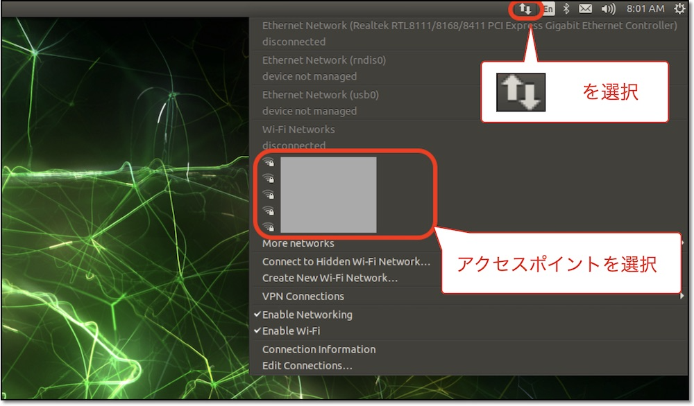

# インターネット接続

!!!Warning
	インターネット接続は必須ではありません。

## WiFiの一覧

```bash
nmcli device wifi list
```

## WiFiの設定値

<div data-lerobot-wifi-panel></div>

フォームに入力すると、下のコマンドのSSIDとパスワード部分が自動で置き換わります。入力した値はこのブラウザ内（localStorage）にのみ保存され、外部には送信されません。


## WiFiの接続コマンド

```bash
sudo nmcli device wifi connect "{{SSID}}" password "{{WIFI_PASS}}"
```

## コマンドではなくGUIで接続する場合

PD-HDMI変換コネクタにHDMIケーブルをさし、マウス、キーボードをUSBい差し込みGUIで操作し接続します。

