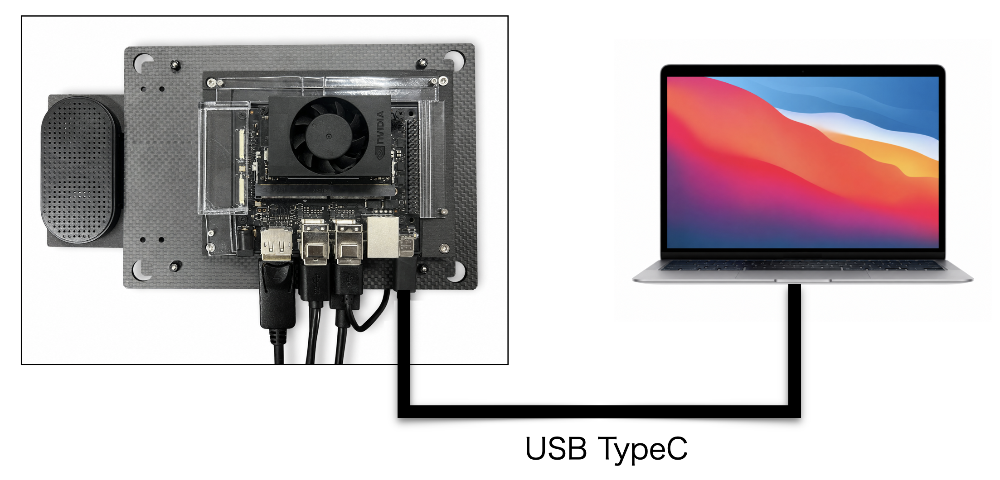

# Mac

## Macとの接続

Macとの接続は、Physical Agent Kit(PAK)とUSB TypeCケーブルで接続します。




## 接続の確認

```bash
ifconfig -a 
```

enXのネットワークデバイスに、下記記述が出てくれば接続可能な状態です。

```bash
en5: flags=8863<UP,BROADCAST,SMART,RUNNING,SIMPLEX,MULTICAST> mtu 1500
	options=404<VLAN_MTU,CHANNEL_IO>
	ether 12:1a:8d:b2:11:fa
	inet6 fe80::63:5a75:bd2c:8f13%en5 prefixlen 64 secured scopeid 0x14 
	inet 192.168.55.100 netmask 0xffffff00 broadcast 192.168.55.255
	nd6 options=201<PERFORMNUD,DAD>
	media: autoselect (2500Base-T <full-duplex>)
	status: active
```

## SSHでの接続

```bash
ssh jetson@192.168.55.1 
```

でJetsonにSSHで接続してください。

|id|pass|
|:--|:--|
|jetson|jetson|
