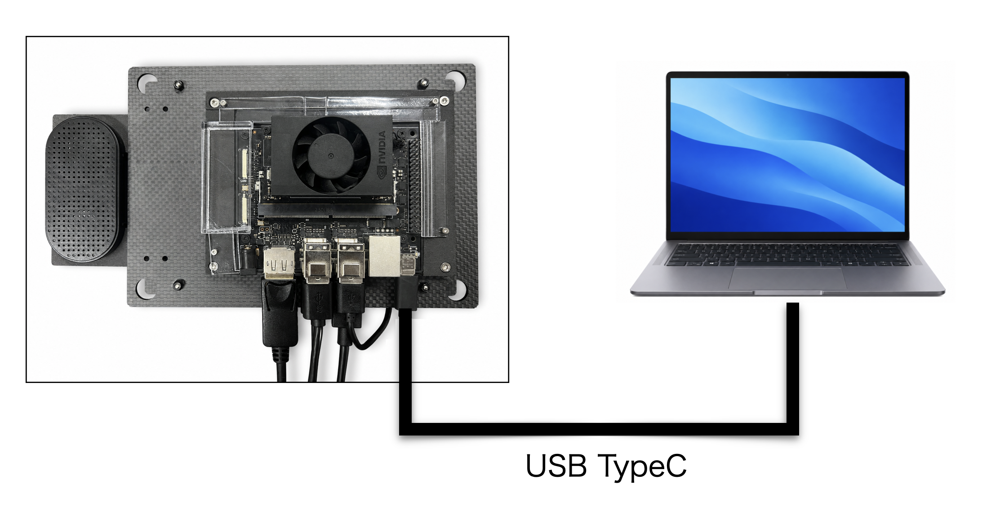
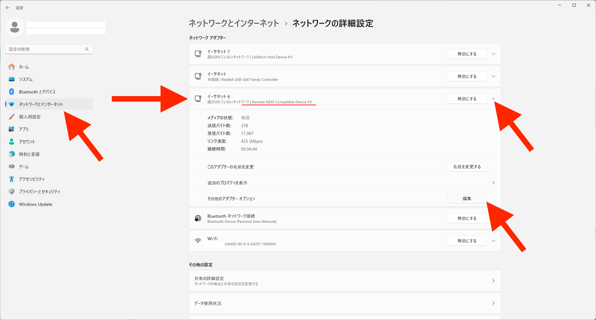
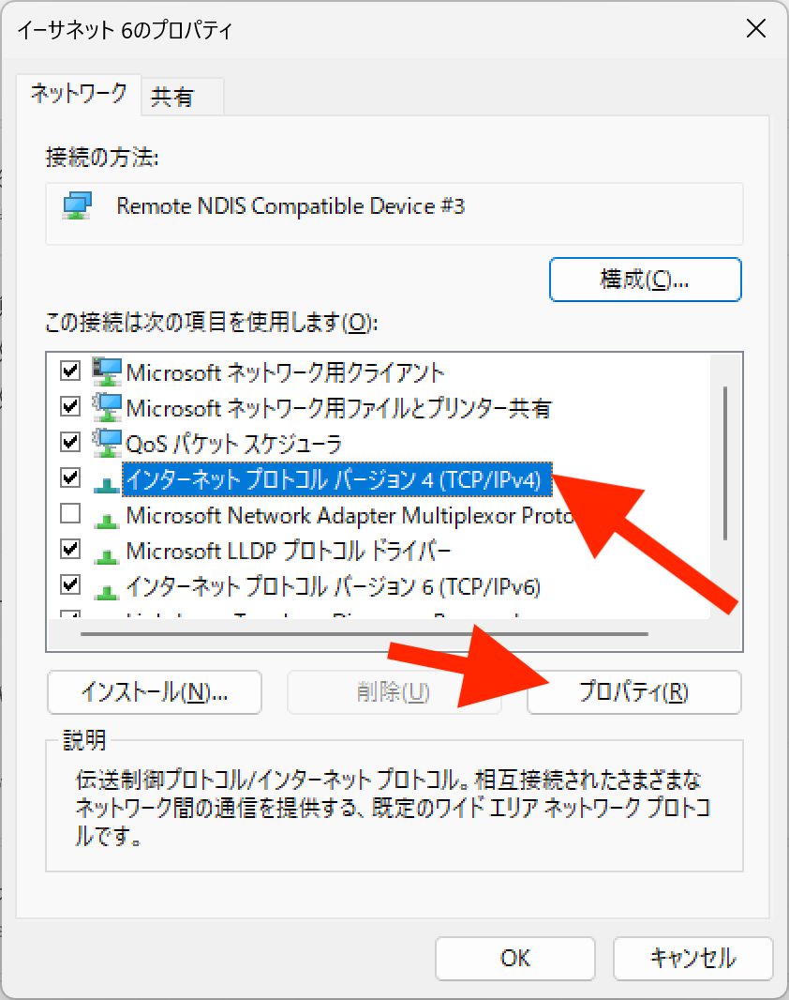
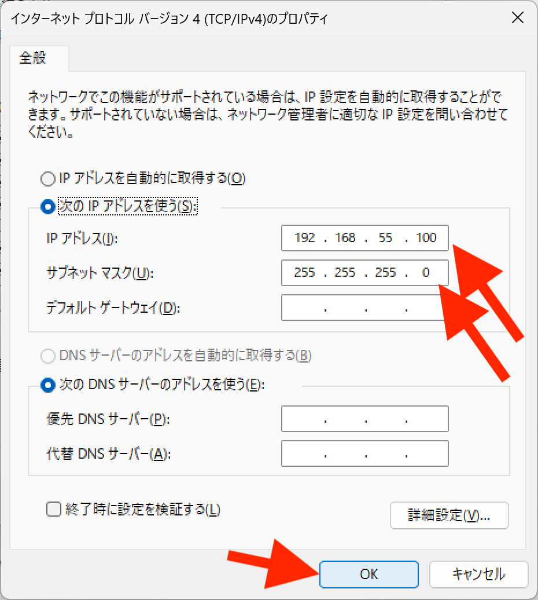

# Windows

## Windowsとの接続

Macとの接続は、Physical Agent Kit(PAK)とUSB TypeCケーブルで接続します。




## SSHでの接続

```bash
ssh jetson@192.168.55.1 
```

でJetsonにSSHで接続してください。

|id|pass|
|:--|:--|
|jetson|jetson|

## SSHでうまく接続できない場合の対処

Windos環境においてUSB Type-CでJetson Orin Nanoに接続できない
一部のWindowsの機種でUSBマイクロでの接続が間欠で途切れることを確認しております。

その場合は、PCに静的なIPアドレス(192.168.55.100)を設定します。

Windowsボタン＞設定＞ネットワークとインターネット>ネットワークの詳細設定

ネットワークアダプタの欄にあるRemote NDIS Compatible Deviceがあるデバイスを選択して↓を押して編集ボタンを押します。



インターネットプロトコルバージョン４（TCP/IPv4)を選択してプロパティボタンを押します。



IPアドレスは、192.168.55.100とサブネットマスクは255.255.255.0と入力いたします。




OKボタンを押します。