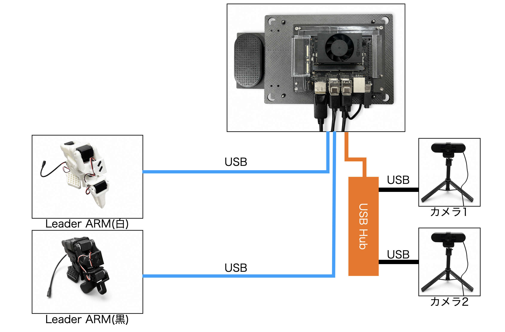
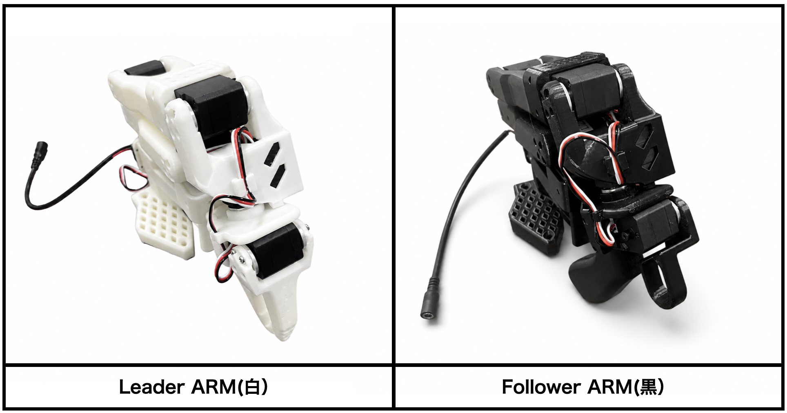
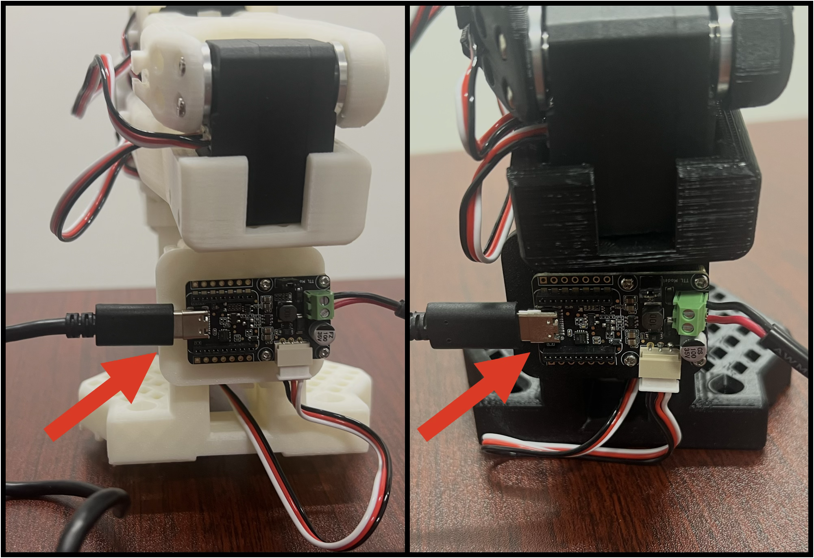
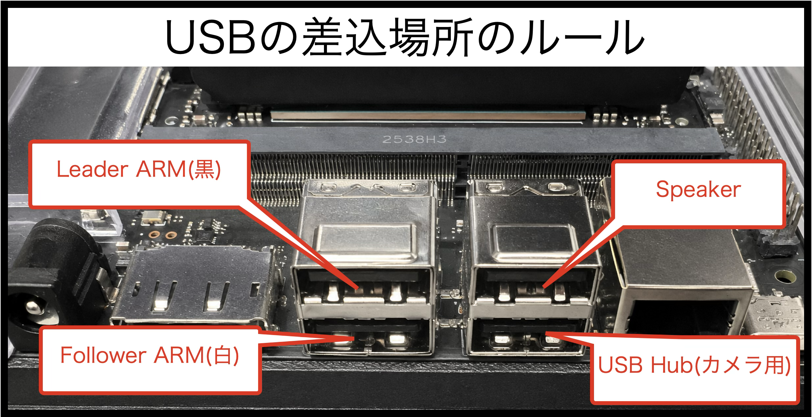

# 配線

## USBの接続場所

FaBo Physical Agent Kit(PAK)の母艦に各種デバイスを接続していきます。

## ロボットアームの接続

Leader ARM(白)とFollower ARM(黒)をPAK本体に接続します。

## PD-HDMI変換ケーブル

トラブル発生時HDMIで、すぐにDisplayに接続できるように、PD-HDMI変換ケーブルも装着しておきます。

