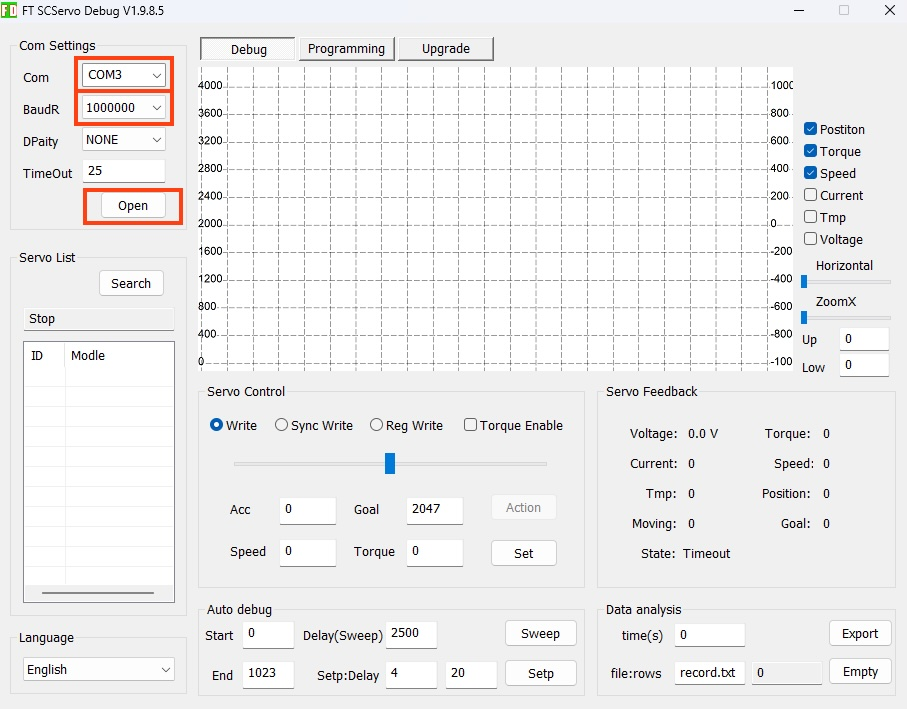

# 設定

!!!Info
	最近流通しているサーボは、すでに3.10以上にアップデートされている可能性が高いので、この作業は実施しなくても大丈夫な可能性が高いです。

## サーボのFimware

サーボのFirmwareの更新は、[FD1.9.8.5](https://gitee.com/ftservo/fddebug/blob/master/FD1.9.8.5(250729).7z)をWindows OSマシンで起動しおこなう。

## 動作に必要なFirmwareのバージョン

|Version|
|--|
|3.10|

## Firmwareのアップデート

## Reference

- [Feetech社 ST3215](https://www.feetechrc.com/products.html?keyword=STS3215)
- [FD1.9.8.5](https://gitee.com/ftservo/fddebug/blob/master/FD1.9.8.5(250729).7z)